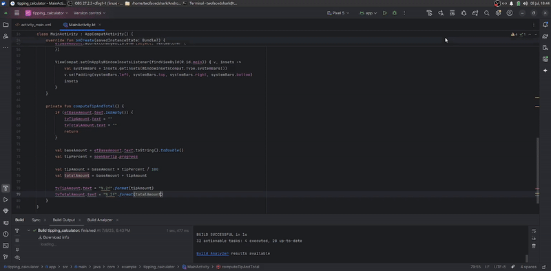

# tip-calculator

Submitted by: **Maximiliano Ovalle**

Time spent: **2** hours spent in total

## Summary

**Tip Calculator** is an android app that helps you calculate how much you should tip based on your bill amount!

## Application Features

The following REQUIRED features are completed:

- [x] At least one (1) user input
- [x] At least one (1) interactive View
- [x] At least one (1) output of a calculation based on the user input

The following STRETCH features are implemented:

- [ ] Implement ViewBinding to reduce boilerplate code and increase efficiency
- [ ] Add at least one (1) additional functionality1

## Video Demo

## License

Copyright **2025** **Maximiliano Ovalle**

Licensed under the Apache License, Version 2.0 (the "License");
you may not use this file except in compliance with the License.
You may obtain a copy of the License at

    http://www.apache.org/licenses/LICENSE-2.0

Unless required by applicable law or agreed to in writing, software
distributed under the License is distributed on an "AS IS" BASIS,
WITHOUT WARRANTIES OR CONDITIONS OF ANY KIND, either express or implied.
See the License for the specific language governing permissions and
limitations under the License.